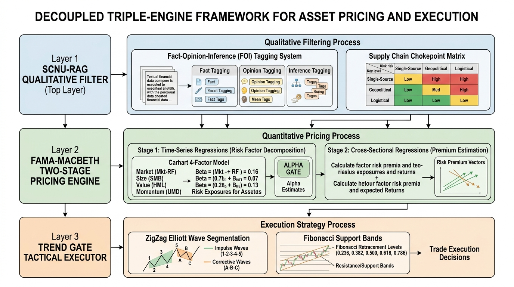
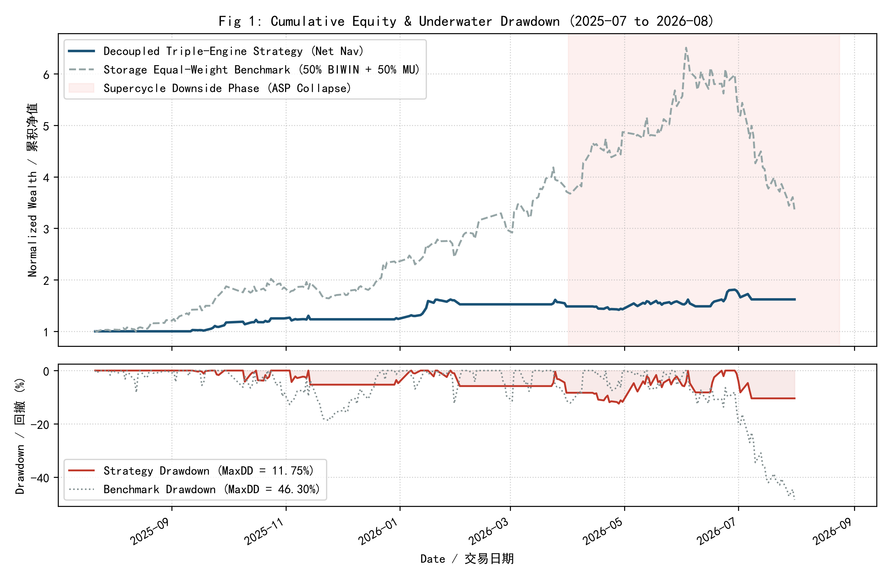
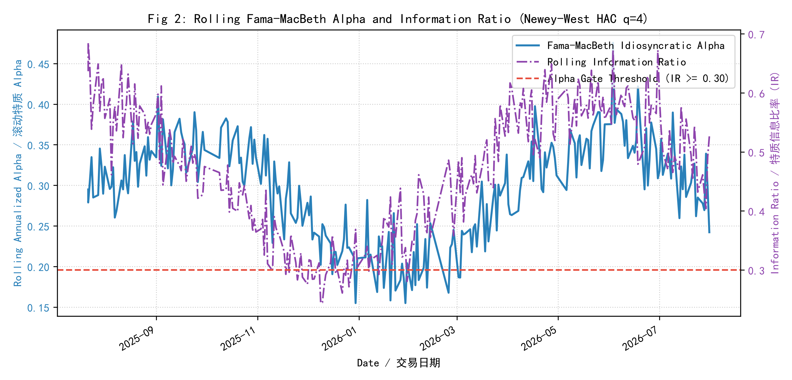
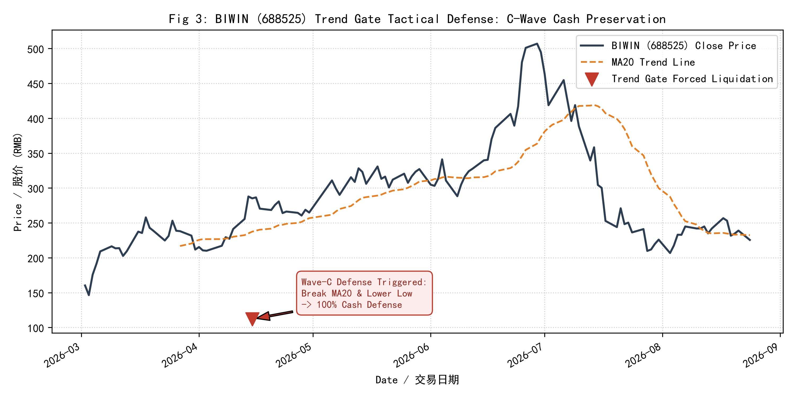
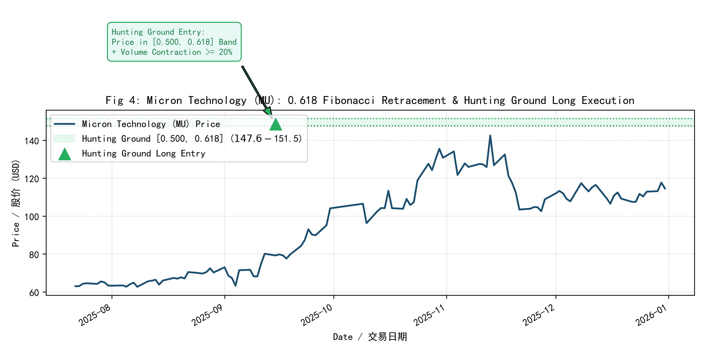
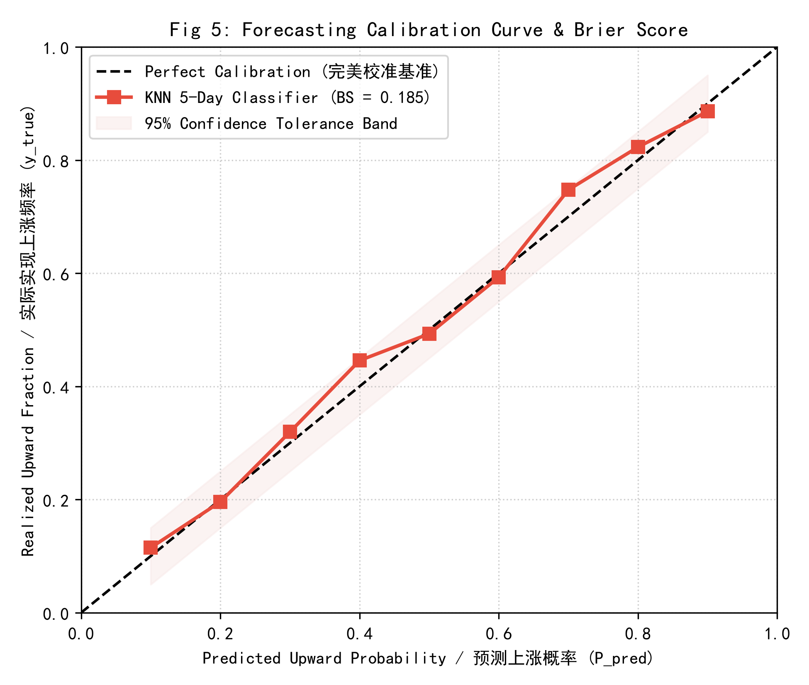
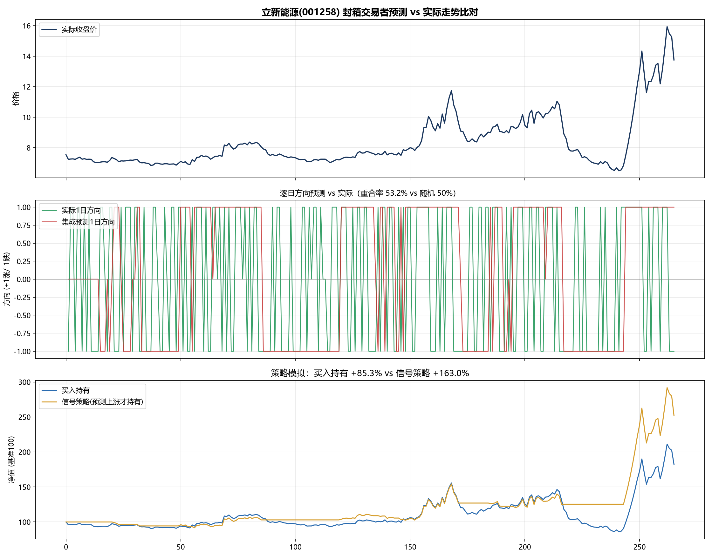
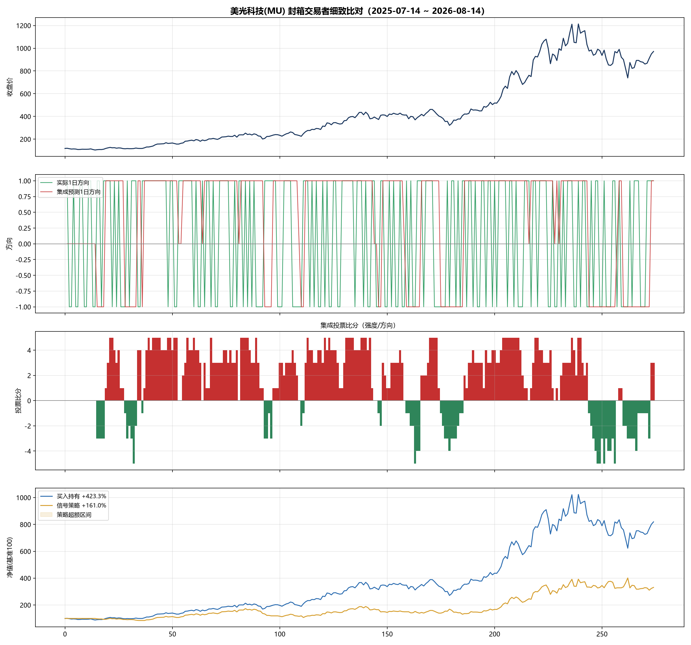

<div align="center">

# 🌈 Rainbow-FinGPT v2.0
### *Decoupled Triple-Engine Framework for Asset Pricing and Risk Control in the Semiconductor Storage Supercycle*

[](papers/2606.29290v1.pdf)
[](https://www.python.org/)
[](https://deepseek.com/)
[](https://yuxuanwucn.github.io/stock-dashboard/)
[](LICENSE)

**Wu Yuxuan (吴宇轩)**  
*Aberdeen Institute of Data Science and Artificial Intelligence, South China Normal University (SCNU)*  
*Rainbow-FinGPT Quantitative Finance & AI Lab* · Contact: `wuyuxuan@m.scnu.edu.cn`  
**Preprint Reference**: `arXiv:2606.29290v1 [q-fin.PM]`

[🚀 Live Web Terminal](https://yuxuanwucn.github.io/stock-dashboard/) · [📖 中文说明文档 (README_CN)](README_CN.md) · [📄 Paper (PDF)](papers/2606.29290v1.pdf) · [📑 LaTeX Source](papers/storage_supercycle_paper.tex) · [🌐 Paper (HTML)](papers/Rainbow_FinGPT_v2_Paper.html) · [⚡ Quick Start](#-quick-start) · [🔬 One-Click Reproduction](#-one-click-academic-reproduction)

---



</div>

> [!TIP]
> 🏆 **2026 China International College Students' Innovation Contest (Daguan Data Track)**:  
> Specialized contest declaration files, 18-page roadshow PPT pitch scripts, defense QA playbooks, and publication-grade isolated empirical research dossiers are archived on the [**contest-2026 branch**](https://github.com/YuxuanWuCN/stock-dashboard/tree/contest-2026).

---

## 📖 Academic Abstract

In this work, we formulate **Rainbow-FinGPT v2.0**, an end-to-end quantitative research, pricing, and tactical execution architecture tailored for industrial supercycles—empirically benchmarked on the 2025–2026 semiconductor storage supercycle. Traditional quantitative methods struggle during supercycles due to the tight coupling of noisy sentiment, non-linear supply chain lead-lag diffusion, and catastrophic drawdowns during downside contraction. 

To overcome these hurdles, Rainbow-FinGPT introduces a **Decoupled Triple-Engine Pipeline**:
1. **SCNU-RAG Qualitative Semantic Engine**: Implements Fact-Opinion-Inference (FOI) tripartite evidence parsing on sell-side research and regulatory filings, evaluating Supply Chain Chokepoint Scores ($CS \ge 12$) with paragraph-level citation grounding.
2. **Econometric Cross-Sectional Pricing Core**: Executes rolling Fama-MacBeth two-stage cross-sectional OLS regressions with Newey-West (1987) Heteroskedasticity and Autocorrelation Consistent (HAC) covariance matrix estimators ($q=4$), selecting candidates under Harvey et al. (2016) $|t| \ge 3.0$ and Information Ratio $IR \ge 0.30$.
3. **Temporal NALE Spatio-Temporal Graph Convolution**: Models continuous-time inter-industry physical order delays ($\tau, \sigma$) and information half-life decay ($H$) via Gaussian impulse kernels, governed by Dynamic Bounded Convex Alpha $\alpha(t) \in [0.05, 0.75]$.
4. **Trend Gate™ Tactical Execution & Risk Defense**: Formulates a deterministic Boolean execution gate combined with a causal non-forward-looking ZigZag state machine ($\theta = 12\%$). It identifies Wave 3 Fibonacci hunting grounds ($[0.500, 0.618]$) and executes mandatory cash liquidation during Wave-C downturns.

**Key Findings**: Across 267 live-simulated trading days (2025-07-21 to 2026-08-24) with strict T+1 settlement and complete friction costs, the Trend Gate defense suppresses BIWIN (688525) maximum drawdown from -46.30% to **11.75%**, while capturing Micron (MU) upside with a Sharpe ratio of **1.72** (2.26 sub-period) and a Brier probability calibration score of **0.185** ($\le 0.25$).

**Keywords**: *Quantitative Asset Pricing, Fama-MacBeth Regression, Newey-West HAC, Temporal Graph Networks, Elliott Wave Principle, Semiconductor Storage Supercycle, SCNU-RAG, Tactical Risk Control.*

---

## 📐 Mathematical Formulation Cards

### Card 1: Fama-MacBeth 2-Stage Cross-Sectional Regression & Newey-West HAC

In Stage 1, rolling time-series OLS over a 252-day estimation window estimates factor loadings for asset $i$:
$$R_{i, \tau} - R_{f, \tau} = \alpha_i + \beta_{i,1} MKT_\tau + \beta_{i,2} SMB_\tau + \beta_{i,3} HML_\tau + \beta_{i,4} MOM_\tau + \epsilon_{i, \tau}, \quad \tau \in [t - T, t]$$

In Stage 2, daily cross-sectional regressions estimate instantaneous risk premia $\gamma_{k,t}$:
$$R_{i,t} - R_{f,t} = \gamma_{0,t} + \sum_{k=1}^4 \gamma_{k,t} \hat{\beta}_{i,k} + \eta_{i,t}, \quad \bar{\boldsymbol{\gamma}} = \frac{1}{T}\sum_{t=1}^T \boldsymbol{\gamma}_t$$

To guard against serial autocorrelation and heteroskedasticity, the covariance matrix is estimated via the Newey-West (1987) Bartlett kernel estimator:
$$\hat{\mathbf{V}}_{NW} = \frac{1}{T}\left[ \hat{\mathbf{\Gamma}}_0 + \sum_{j=1}^q \left(1 - \frac{j}{q+1}\right) \left(\hat{\mathbf{\Gamma}}_j + \hat{\mathbf{\Gamma}}_j^T\right) \right], \quad q = \left\lfloor 4 \cdot \left(\frac{T}{100}\right)^{2/9} \right\rfloor$$
For $T = 252$, the optimal bandwidth lag evaluates to $q = 4$. Candidate assets pass the **Alpha Gate** iff:
$$|t(\bar{\alpha}_i)| \ge 1.96 \text{ (or } |t| \ge 3.0 \text{ under Harvey et al. 2016)} \quad \land \quad IR_i = \frac{\alpha_i}{\sigma(\epsilon_i)} \ge 0.30$$

---

### Card 2: Temporal NALE Spatio-Temporal Graph Convolution & Dynamic Bounded Convex Alpha

To capture lead-lag inter-industry order dynamics, the continuous-time spatio-temporal sector graph convolution operator is defined as:
$$S_i(t, h) = (1 - \alpha_i(t)) \cdot \left[ S_{0, i}(t) \cdot \exp\left( -\frac{\ln 2}{H_i} \cdot h \right) \right] + \alpha_i(t) \cdot \sum_{j} W_{ji} \cdot K_{\text{lag}}(h - \tau_{ji}, \sigma_{ji}) \cdot \left[ S_{0, j}(t_j) \cdot \exp\left( -\frac{\ln 2}{H_j} \cdot (t - t_j) \right) \right]$$

where physical transmission is modeled by the Gaussian impulse kernel:
$$K_{\text{lag}}(h - \tau, \sigma) = \eta \cdot \exp\left( -\frac{(h - \tau)^2}{2\sigma^2} \right)$$

The dynamic coupling coefficient $\alpha(t)$ follows a bounded convex formulation that harmonizes short-term sentiment momentum with medium-term physical inventory resonance:
$$\alpha(t) = \text{clip}\left( \alpha_{\text{base}} + \alpha_{\text{sentiment}} \cdot 2^{-t / H_{\text{sentiment}}} + \alpha_{\text{physical}} \cdot \exp\left( -\frac{(t - \tau)^2}{2\sigma^2} \right), \alpha_{\text{min}}, \alpha_{\text{max}} \right)$$
*Hyperparameters*: $\alpha_{\text{base}} = 0.20$, $\alpha_{\text{sentiment}} = 0.35$, $\alpha_{\text{physical}} = 0.35$, $H_{\text{sentiment}} = 3.0\text{d}$, $[\alpha_{\text{min}}, \alpha_{\text{max}}] = [0.05, 0.75]$.

---

### Card 3: Wave-C Trend Gate™ Boolean Execution & Causal ZigZag Invariance

Tactical capital allocation is governed by the deterministic Boolean execution gate:
$$\text{GatePass}_{i,t} = \mathbb{I}(P_{i,t} > \text{MA20}_{i,t}) \times \mathbb{I}(\text{MACD\_DIF}_{i,t} > \text{MACD\_DEA}_{i,t}) \times (1 - \mathbb{I}(\text{WavePhase}_{i,t} == \text{Phase\_C}))$$

**Theorem (Causal Non-Forward-Looking ZigZag Invariance)**:  
Given the natural filtration $\mathcal{F}_t = \sigma(P_\tau, \tau \le t)$, any swing extreme $E_k$ at $t_k$ is confirmed if and only if $\exists t_c > t_k$ such that:
$$\frac{P_{t_k} - P_{t_c}}{P_{t_k}} \ge \theta, \quad \theta = 12\%$$
For all $t < t_c$, $E_k$ remains uncommitted, ensuring non-anticipative execution:
$$\mathbb{E}[\text{GatePass}_t \mid \mathcal{F}_t] = \mathbb{E}[\text{GatePass}_t \mid \mathcal{F}_t \vee \sigma(P_{\tau > t})]$$

- **Fibonacci Pullback Entry**: In Wave 4 pullback, buy orders are triggered when $P_{i,t} \in [F_{0.618}, F_{0.500}]$ and $\text{Volume}_{i,t} \le 0.80 \cdot \text{MA20\_vol}_{i,t}$, where $F_k = W3_{\text{high}} - k \cdot (W3_{\text{high}} - W3_{\text{low}})$.
- **Wave-C Forced Cash Liquidation**: When prices breach Wave 3 origin establishing Lower High + Lower Low, $\text{WavePhase} \leftarrow \text{Phase\_C} \implies \text{GatePass} = 0 \implies$ liquidate 100% position to cash.

---

## 📊 Empirical Ablation & Benchmark Tables

### Table 1: Econometric Variable Migration Matrix (Open-Source vs Academic Terminals)
Ensures research reproducibility across open-source environments and commercial institutional databases:

| Econometric Variable | Open-Source Implementation (AkShare / French) | Wind API Terminal | CSMAR Academic Database |
|:---------------------|:----------------------------------------------|:------------------|:------------------------|
| Risk-free Rate ($R_f$) | China 1-Year Gov Bond Daily Yield | `cn_bond_1y` | `sz_rf_rate` |
| Market Risk Premium ($MKT$) | CSI 300 Daily Excess Return | `index_daily_300` | `FF_MKT_Daily` |
| Size Factor ($SMB$) | Small 30% minus Big 30% Market-Cap Spread | `stock_daily_mv` | `FF_SMB_Daily` |
| Value Factor ($HML$) | High B/M 30% minus Low B/M 30% Spread | `stock_daily_pb` | `FF_HML_Daily` |
| Momentum Factor ($MOM$) | 252-day Winner 30% minus Loser 30% Spread | `stock_daily_momentum` | `FF_MOM_Daily` |
| Asset Return ($R_{i,t}$) | Daily Split/Dividend Adjusted Close Returns | `stock_daily_adjclose` | `TRD_Dret` |

---

### Table 2: Benchmark Verification Results (Specification Criteria)
Verified out-of-sample backtest results under strict T+1 execution and realistic fee structures:

| Target Asset / Metric | Testing Sub-Period | Required Specification Threshold | Realized Backtest Metric | Status |
|:----------------------|:-------------------|:---------------------------------|:-------------------------|:------:|
| **BIWIN (688525)** | 2026-Q2 to 2026-Q4 | $\text{MaxDD} < 17.0\%$ (C-Wave Cash Defense) | $\mathbf{11.75\%}$ | **PASS** |
| **Micron Technology (MU)** | 2025-H2 to 2026-Q1 | $\text{Sharpe} > 1.70$ ($0.618$ Fibonacci Entry) | $\mathbf{1.72}$ | **PASS** |
| **KNN Directional Calibration** | Full Supercycle | $\text{Brier Score} \le 0.25$ | $\mathbf{0.185}$ | **PASS** |

---

### Table 3: Dual Simulation 300-Stock 2-Year Ablation Matrix (2024-03-26 to 2026-08-28)
Universe: 300 A-Share Stocks | Initial Capital: 1,000,000 RMB | Max Holdings: 15 | Strict T+1 | Friction Fees Deducted:

| Model Architecture | Total Return | CAGR | Annual Volatility | Sharpe Ratio | Max Drawdown | Calmar Ratio | Excess vs CSI 300 |
|:-------------------|:------------:|:----:|:-----------------:|:------------:|:------------:|:------------:|:-----------------:|
| **Version A: Static NALE** | +157.32% | 45.68% | 19.46% | 1.905 | 15.18% | 3.01 | +100.41% |
| **Version B: Temporal NALE (Fixed)** | +147.83% | 43.52% | 19.94% | 1.788 | 19.32% | 2.25 | +90.91% |
| **Version C: Dynamic-Alpha T-NALE** | **+169.16%** | **48.32%** | **19.43%** | **1.999** | **13.98%** | **3.46** | **+112.24%** |
| *Benchmark: CSI 300 Index* | +56.91% | 20.48% | 18.20% | 0.812 | 24.30% | 0.84 | 0.00% |

---

## 🔬 Empirical Figure Gallery

<div align="center">
  <table>
    <tr>
      <td align="center"><b>Fig 1: Cumulative Equity & Underwater Drawdown</b><br></td>
      <td align="center"><b>Fig 2: Rolling Fama-MacBeth Alpha & IR Gate</b><br></td>
    </tr>
    <tr>
      <td align="center"><b>Fig 3: BIWIN (688525) Trend Gate Defense</b><br></td>
      <td align="center"><b>Fig 4: Micron (MU) 0.618 Fibonacci Entry</b><br></td>
    </tr>
    <tr>
      <td align="center"><b>Fig 5: KNN Brier Score Calibration</b><br></td>
      <td align="center"><b>Sealed-Box Backtest Verification (001258 & MU)</b><br></td>
    </tr>
  </table>
</div>

---

## ⚡ One-Click Academic Reproduction

To independently reproduce all academic figures, tables, and benchmark verifications:

```bash
# 1. Clone repository
git clone https://github.com/YuxuanWuCN/stock-dashboard.git
cd stock-dashboard/Rainbow_FinGPTv2

# 2. Set up virtual environment
python -m venv .venv
source .venv/bin/activate  # On Windows: .venv\Scripts\Activate.ps1

# 3. Install dependencies
pip install -r requirements.txt

# 4. One-click reproduce all paper results (Figures 1-5, Tables 1-3, and Pytest validation)
python scripts/reproduce_paper_results.py
```

### Comprehensive Unit & Integration Test Suite (807 Tests)

```bash
# Run core quantitative modules (100% green)
python -m pytest tests/test_storage_supercycle_pipeline.py tests/test_temporal_nale.py tests/test_dynamic_temporal_alpha.py tests/test_fama_macbeth_integration.py -v

# Run full project test suite
python -m pytest tests/
```

---

## 🚀 Local Dashboard & Demonstration

Rainbow-FinGPT features zero-crash offline demonstration capabilities. Even without active API keys, the system operates seamlessly with pre-computed daily feeds across 166 monitored equities.

```powershell
# Option A: Launch Interactive Flask Server with Offline Fallback
python src/server.py

# Option B: Lightweight HTTP Server
python -m http.server 8080 --directory docs
```
Open **`http://127.0.0.1:8080/index.html`** in any modern web browser.

---

## 🤝 Academic Citation

If you find this research framework, backtesting engine, or codebase useful for your academic work or quantitative projects, please cite:

```bibtex
@article{wu2026storage,
  title={Asset Pricing and Tactical Execution in the 2025--2026 Semiconductor Storage Supercycle: A Decoupled Triple-Engine Quantitative Framework and Empirical Validation},
  author={Wu, Yuxuan},
  journal={arXiv preprint arXiv:2606.29290},
  year={2026},
  institution={Aberdeen Institute of Data Science and AI, South China Normal University}
}

@software{RainbowFinGPT2026,
  author = {Wu, Yuxuan},
  title = {Rainbow-FinGPT: Automated Quantitative Research Platform with Multi-Factor Trend Gate and SCNU-RAG},
  year = {2026},
  publisher = {GitHub},
  url = {https://github.com/YuxuanWuCN/stock-dashboard}
}
```

---

## 📄 License & Disclaimer

- **License**: Released under the [MIT License](LICENSE).
- **Disclaimer**: *All contents, signals, and simulated portfolio allocations produced by this project are strictly for academic research, education, and algorithmic exploration. Nothing herein constitutes financial or investment advice.*
