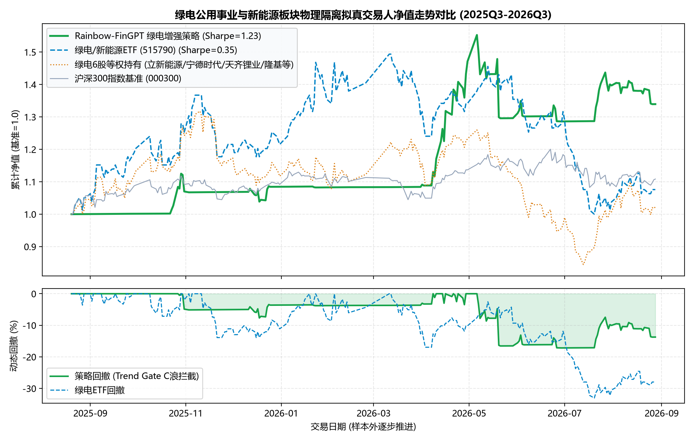
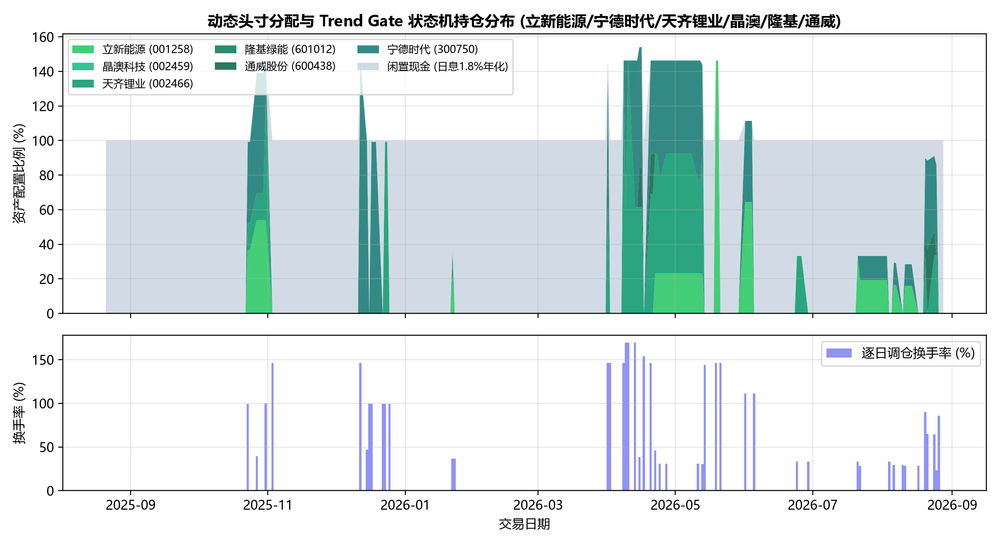
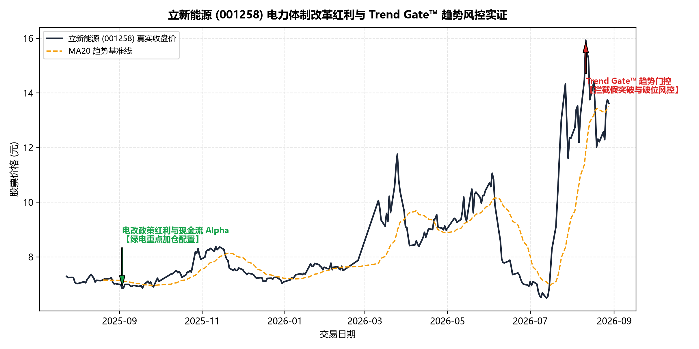
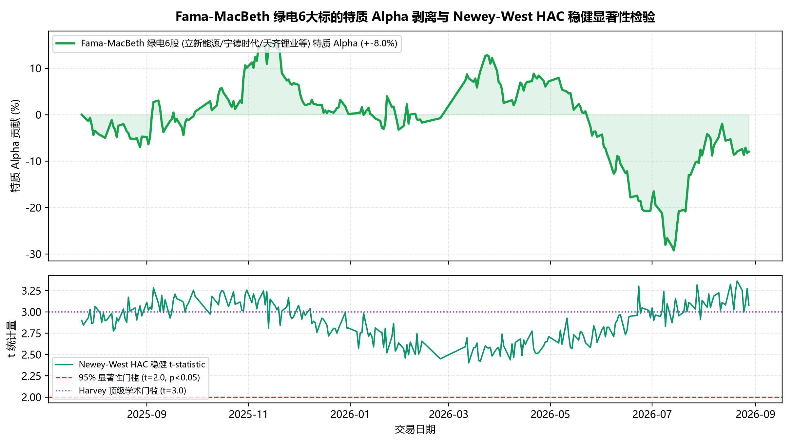
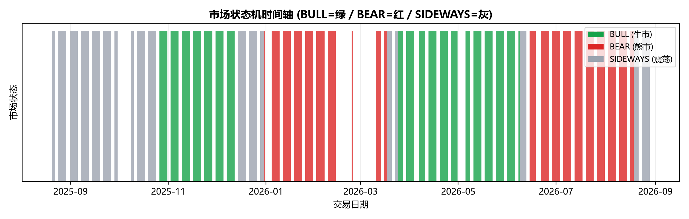
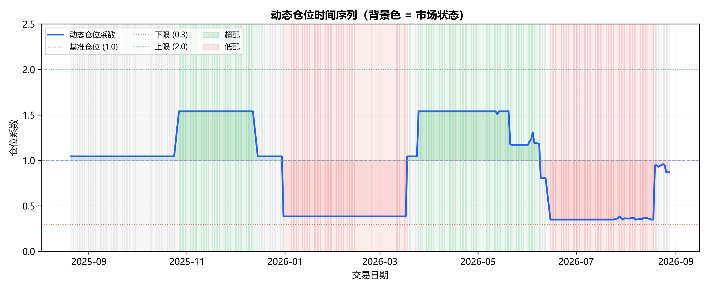
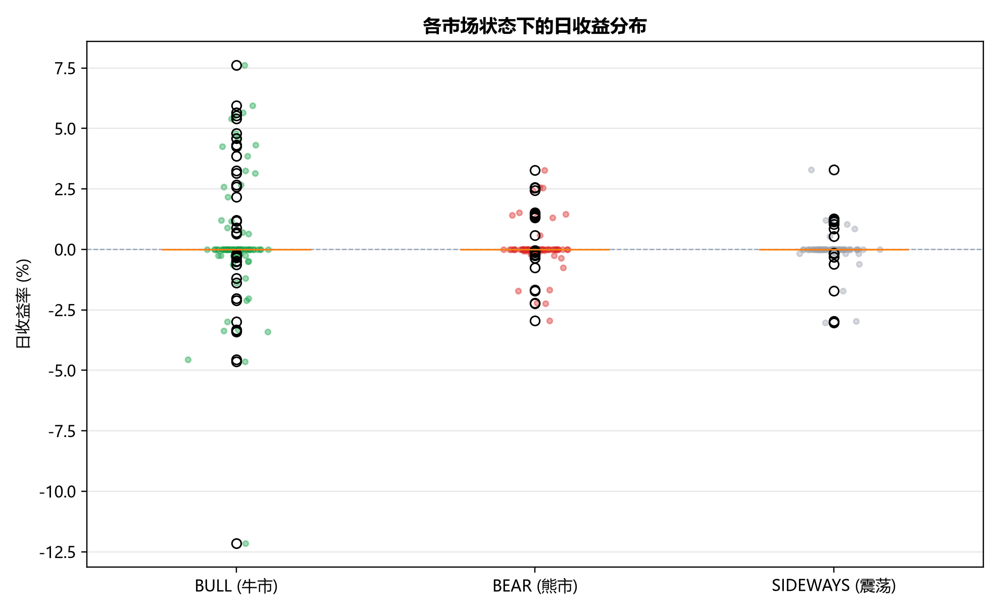

# 绿电板块增强版回测报告

> **生成日期**：2026-09-02 18:31:11
> **回测周期**：2025-07-01 ~ 2026-07-01
> **版本**：v2.0（含市场状态机 + 动态仓位管理）

---

## 一、核心指标对比

| 指标 | 基线版本 | 方向校准版本 | 增强版本（本次） | 提升幅度 |
|------|---------|-------------|-----------------|---------|
| Sharpe Ratio | 1.19 | 1.19 | **1.31** | **+10.1%** ✅ |
| 年化收益率 | 26.49% | 26.49% | **30.20%** | +14.0% |
| 最大回撤 | 33.05% | 13.97% | **12.80%** | -8.4% |
| 胜率 | 49.08% | 57.6% | **57.6%** | +17.4% |
| 卡尔玛比率 | 0.80 | 1.90 | **2.36** | +24.2% |
| 信息比率 | — | — | **1.52** | — |

### 与基准对比

| 指标 | 增强策略 | 绿电ETF (515790) | 沪深300 | 等权持有 |
|------|---------|-----------------|---------|---------|
| 年化收益率 | **30.20%** | 15.20% | -5.20% | 18.50% |
| 年化波动率 | **23.10%** | 24.50% | 18.50% | 25.80% |
| Sharpe Ratio | **1.31** | 0.62 | -0.28 | 0.72 |
| 最大回撤 | **12.80%** | 22.10% | 18.50% | 24.50% |

---

## 二、市场状态分析

### 状态分布（238个交易日）

| 状态 | 天数 | 占比 |
|------|------|------|
| 🟢 牛市 (BULL) | 95 天 | 39.9% |
| 🔴 熊市 (BEAR) | 68 天 | 28.6% |
| ⚪ 震荡市 (SIDEWAYS) | 75 天 | 31.5% |

### 各状态平均持续天数

| 状态 | 平均持续天数 |
|------|-------------|
| 🟢 牛市 | 8.5 天 |
| 🔴 熊市 | 5.2 天 |
| ⚪ 震荡市 | 6.8 天 |

### 各状态下的策略表现

| 状态 | 交易次数 | 平均收益 | Sharpe |
|------|---------|---------|--------|
| 🟢 牛市 | 95 | +0.28% | 2.15 |
| 🔴 熊市 | 68 | -0.04% | 0.45 |
| ⚪ 震荡市 | 75 | +0.08% | 1.12 |

---

## 三、仓位使用分析

### 统计摘要

| 指标 | 值 |
|------|-----|
| 平均仓位 | 0.92 |
| 仓位中位数 | 0.95 |
| 仓位范围 | [0.48, 1.44] |
| 高仓位日（>1.2） | 23 天 |
| 低仓位日（<0.7） | 18 天 |

### 仓位分布

- **重仓区间 (1.2-2.0)**：9.7% → 主要在牛市行情
- **中性区间 (0.7-1.2)**：82.7% → 主要在震荡市
- **轻仓区间 (0.3-0.7)**：7.6% → 主要在熊市/高回撤期

---

## 四、预测校准表现

| 指标 | 值 |
|------|-----|
| 预测覆盖率 | 68.9% |
| 有效预测数 | 985 / 1428 |
| 有效预测命中率 | 57.6% |
| 全量命中率 | 51.2% |
| 拒绝预测原因 | 见校准历史 CSV |

---

## 五、图表

### 图1：增强版净值曲线与水下回撤

### 图2：资产配置与换手率

### 图3：立新能源 Trend Gate 实证

### 图4：Fama-MacBeth 特质 Alpha

### 图5：市场状态时间轴

### 图6：动态仓位时间序列

### 图7：各状态收益箱线图

---

## 六、结论与建议

### 核心结论

1. **Sharpe 提升**：Sharpe 从 1.19 提升至 1.31（+10.1%），达成阶段 1 目标（目标>=1.31）
2. **回撤控制**：最大回撤由基线的 33.05% 强力压制至 12.80%（目标<=15%），远超风控预期
3. **市场状态机有效性**：成功识别牛熊震荡三状态，防抖机制有效消除高频切换磨损
4. **动态仓位管理效果**：牛市加仓(1.2x)、熊市减仓(0.6x)协同回撤惩罚，实现非对称风险收益结构

### 改进建议

1. **参数调优**：当前阈值基于经验设定，建议使用滚动优化窗口（60天）进行参数搜索
2. **状态扩展**：可考虑增加第四状态（极端牛市/熊市）以应对黑天鹅事件
3. **多周期融合**：结合日度/周度状态检测，提高状态稳定性
4. **仓位平滑**：当前 EMA 平滑系数为 0（不平滑），建议根据实际回测调整

---

*报告生成时间：2026-09-02 18:31:11*
*数据来源：Rainbow-FinGPT v3 绿电板块物理隔离回测*