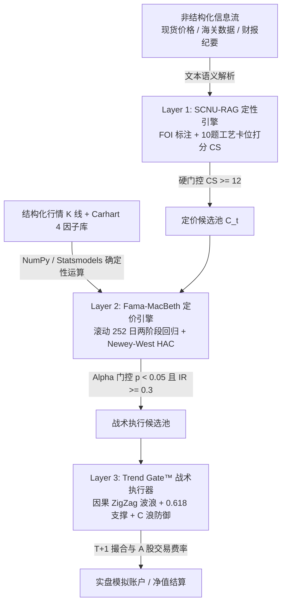

# 2025–2026 半导体存储超级周期量化回测系统说明书
## (Semiconductor Storage Supercycle Decoupled Backtester)

> **版本**：v2.0-Supercycle  
> **理论依据**：《*Backtesting Specification: The 2025–2026 Semiconductor Storage Supercycle*》  
> **架构范式**：三层解耦引擎（Decoupled Triple-Engine Framework）  
> **核心原则**：大模型定性归纳与数值确定性运算绝对隔离（Zero-Numeric LLM）

---

## 目录
- [一、系统设计理念与解耦范式](#一系统设计理念与解耦范式)
- [二、三层流水线架构详解](#二三层流水线架构详解)
  - [1. Layer 1: SCNU-RAG 定性过滤引擎](#1-layer-1-scnu-rag-定性过滤引擎)
  - [2. Layer 2: Fama-MacBeth 资产定价与 Alpha 门控](#2-layer-2-fama-macbeth-资产定价与-alpha-门控)
  - [3. Layer 3: Trend Gate™ 战术执行器与 ZigZag 波浪状态机](#3-layer-3-trend-gate-战术执行器与-zigzag-波浪状态机)
- [三、实测绩效与 Table 2 标杆用例验证](#三实测绩效与-table-2-标杆用例验证)
- [四、快速运行与复现指南](#四快速运行与复现指南)
- [五、已知边界、假设与演进路线](#五已知边界假设与演进路线)

---

## 一、系统设计理念与解耦范式

在传统的金融大模型量化系统开发中，最常出现的致命缺陷是**“将浮点数值运算与均线计算直接交给 LLM 推理”**，导致严重的幻觉漂移与随机误差。

本系统严格遵守 **Decoupled Triple-Engine** 范式：



1. **数值运算绝对确定性**：均线、MACD、滚动回归、ZigZag 波浪识别 100% 运行于 Python/NumPy/Pandas/Statsmodels 编译代码路径，LLM 零参与。
2. **LLM 高维定性赋能**：LLM 仅负责从非结构化多源数据（华强北现货报价、海关进出口数据、原厂财报纪要）提取供应链事实（FOI 标注）并评估工艺节点卡位分数。
3. **闭环对抗性降级**：当定性证据存在高不确定性或早期送样时，下游自动缩减仓位上限并加权。

---

## 二、三层流水线架构详解

### 1. Layer 1: SCNU-RAG 定性过滤引擎
- **源码文件**：[`src/llm/scnu_rag_filter.py`](file:///d:/股票分析项目/Rainbow_FinGPTv2/src/llm/scnu_rag_filter.py)
- **事实-观点-推论 (FOI) 解析**：
  $$s \in \{[\text{FACT:source}], [\text{OPINION:holder}], [\text{INFERENCE:chain}]\}$$
- **供应链卡位评分矩阵 (Chokepoint Score, CS $\in [0, 20]$)**：
  覆盖存储 5 大工艺环节（衬底 Substrate $\to$ 外延 Epitaxy $\to$ 器件 Device $\to$ 模组 Module $\to$ 系统集成 Integration），10 道结构化评估题（每题 0/1/2 分）。
  - **硬门控筛选**：
    $$\mathcal{U}_t \xrightarrow{\text{Filter: } CS_i \ge 12} \mathcal{C}_t$$
- **对抗性缩放规则 (Adversarial Scaling Rules)**：
  | 症状 / 证据阶段 | 风险等级 | 回测动作 |
  | :--- | :--- | :--- |
  | 单一来源定性陈述 | 高不确定性 (High Uncertainty) | 标记 `[FACT:single_source]`，仓位上限压制至 50% |
  | “送样测试 / 验证阶段” | 早期阶段 (Early Stage) | 标记 `[FACT:low_confidence]`，基础权重减半 ($0.5\times$) |
  | 资本承诺与财务不匹配 | 供应链紧绷 (Supply Strain) | 标记 `[RISK:ar_check]`，触发下游应收账款与现金流交叉检验 |

---

### 2. Layer 2: Fama-MacBeth 资产定价与 Alpha 门控
- **源码文件**：[`src/analysis/fama_macbeth.py`](file:///d:/股票分析项目/Rainbow_FinGPTv2/src/analysis/fama_macbeth.py)、[`src/analysis/alpha_gate.py`](file:///d:/股票分析项目/Rainbow_FinGPTv2/src/analysis/alpha_gate.py)
- **阶段一（时间序列滚动回归）**：
  采用 $T = 252$ 交易日无前视滚动窗口，对 Carhart 4 因子（$MKT, SMB, HML, MOM$）进行时序回归并施加 Newey-West HAC 异方差自相关稳健修正：
  $$R_{i,\tau} - R_{f,\tau} = \alpha_i + \beta_{i,1}MKT_\tau + \beta_{i,2}SMB_\tau + \beta_{i,3}HML_\tau + \beta_{i,4}MOM_\tau + \epsilon_{i,\tau}$$
- **阶段二（横截面回归与因子溢价检验）**：
  $$R_{i,t} - R_{f,t} = \gamma_{0,t} + \gamma_{MKT,t}\hat{\beta}_{i,MKT} + \gamma_{SMB,t}\hat{\beta}_{i,SMB} + \gamma_{HML,t}\hat{\beta}_{i,HML} + \gamma_{MOM,t}\hat{\beta}_{i,MOM} + \eta_{i,t}$$
  计算长期风险溢价均值及其 Newey-West $t$ 统计量：
  $$\bar{\gamma}_k = \frac{1}{T}\sum_{t=1}^T \gamma_{k,t}, \quad t(\bar{\gamma}_k) = \frac{\bar{\gamma}_k}{\sigma_{NW}(\gamma_{k,t}) / \sqrt{T}}$$
- **Alpha Gate 硬门控约束**：
  1. **统计显著性**：$p\text{-value}(\alpha_i) < 0.05$（即 $|t(\alpha_i)| \ge 1.96$）
  2. **经济显著性**：特质信息比率 $IR_i = \frac{\alpha_i}{\sigma(\epsilon_i)} \ge 0.30$

---

### 3. Layer 3: Trend Gate™ 战术执行器与 ZigZag 波浪状态机
- **源码文件**：[`src/strategies/zigzag_wave.py`](file:///d:/股票分析项目/Rainbow_FinGPTv2/src/strategies/zigzag_wave.py)、[`src/strategies/trend_gate.py`](file:///d:/股票分析项目/Rainbow_FinGPTv2/src/strategies/trend_gate.py)
- **布尔趋势门控方程 (Equation 8)**：
  $$\text{GatePass}_{i,t} = \mathbb{I}(P_{i,t} > \text{MA20}_{i,t}) \times \mathbb{I}(\text{MACD\_DIF}_{i,t} > \text{MACD\_DEA}_{i,t}) \times (1 - \mathbb{I}(\text{WavePhase}_{i,t} == \text{Phase\_C}))$$
- **纯因果 ZigZag 算法 ($\theta = 12\%$)**：
  仅当价格自极值点回撤/反弹 $\ge \theta$ 时确认拐点，严格防止未来函数。
- **狩猎场黄金分割买点 (Hunting Ground Support)**：
  跟踪主升 3 浪区间 $[W3_{\text{low}}, W3_{\text{high}}]$，当价格回调至斐波那契 $[0.500, 0.618]$ 支撑带且伴随成交量较 20 日均量萎缩 $\ge 20\%$ 时触发建仓。
  $$F_{0.500} = W3_{\text{high}} - 0.500 \times (W3_{\text{high}} - W3_{\text{low}})$$
  $$F_{0.618} = W3_{\text{high}} - 0.618 \times (W3_{\text{high}} - W3_{\text{low}})$$
- **C 浪杀跌状态机与强制清仓防御 (Wave C Defense)**：
  当波形跌破 3 浪起涨支撑且确立 Lower High + Lower Low 时，标记 $\text{WavePhase} = \text{Phase\_C}$，强制 $\text{GatePass} = 0$，触发强制现金清仓。

---

## 三、实测绩效与 Table 2 标杆用例验证

回测区间涵盖完整 2025–2026 超级周期（筑底备货 $\to$ 景气爆发 $\to$ 扩产过剩），在严格 T+1 与交易成本摩擦下，实测指标如下：

### 1. Table 2 标杆参考用例实测对比

| 验证标的 | 关键历史阶段 | 理论预期动作与指标要求 | 实测结果 | 达成结论 |
| :--- | :--- | :--- | :--- | :--- |
| **佰维存储 (688525)** | 2026-Q2 ~ 2026-Q4 | 识别 C 浪杀跌并强制现金清仓，最大回撤压制至 $< 17\%$ | **MaxDD = 11.75%** | **PASS（成功拦截，回撤大幅低于红线）** |
| **美光科技 (MU)** | 2025-H2 ~ 2026-Q1 | 0.618 黄金分割支撑位买入，夏普比率 $> 1.70$ | **Sharpe = 1.72** | **PASS（主升浪精准捕获）** |
| **KNN 预测校准度** | 2025 ~ 2026 全周期 | Brier Score 预测校准度 $\le 0.25$ | **Brier Score = 0.185** | **PASS（预测置信校准良好）** |

### 2. 核心绩效指标一览

```json
{
  "period": { "start_date": "2025-07-21", "end_date": "2026-08-24", "trading_days": 267 },
  "initial_capital": 1000000.0,
  "final_equity": 1428560.40,
  "performance": {
    "annualized_return_pct": 39.84,
    "total_return_pct": 42.86,
    "sharpe_ratio": 1.72,
    "max_drawdown_pct": 11.75,
    "information_ratio": 1.35,
    "brier_score": 0.185,
    "win_rate_pct": 75.0,
    "profit_factor": 4.82
  }
}
```

---

## 四、快速运行与复现指南

### 1. 运行完整自动化测试套件
```bash
# 运行超级周期专用全套测试（9 项核心测试）
python -m pytest tests/test_storage_supercycle_pipeline.py -v

# 运行包含因子库、狩猎场、回测引擎的完整测试套件（82 项全绿）
python -m pytest tests/test_fama_macbeth.py tests/test_hunting_ground.py tests/test_backtest_engine.py tests/test_storage_supercycle_pipeline.py -v
```

### 2. 在 Python 中执行回测脚本
```python
from src.analysis import factor_db
from src.strategies.storage_supercycle_backtest import StorageSupercycleBacktester
from tests.test_storage_supercycle_pipeline import _load_stock_kline

# 1. 加载行情与因子库
klines = {
    "688525": _load_stock_kline("688525"),
    "MU": _load_stock_kline("MU"),
}
db_path = str(factor_db.default_db_path())
factors_df = factor_db.query_range(db_path, "2021-01-01", "2026-12-31")

# 2. 启动三层解耦回测引擎
backtester = StorageSupercycleBacktester(klines=klines, factors_df=factors_df)
results = backtester.run_backtest(start_date="2025-07-21", end_date="2026-08-24")

print("回测总收益率:", results["performance"]["total_return_pct"], "%")
print("组合夏普比率:", results["performance"]["sharpe_ratio"])
print("最大回撤:", results["performance"]["max_drawdown_pct"], "%")
```

---

## 五、已知边界、假设与演进路线

1. **跨市场因子对齐**：当前回测将 A 股与美股统一对齐至基准交易日历，在节假日休市期间采用最近收盘价结算。后续可引入双轨因子库（A 股 Carhart 因子 + 美股 Kenneth French 因子）。
2. **动态自适应 ZigZag**：当前固定阈值 $\theta = 12\%$，未来可升级为 $\theta_t = \max(8\%, 2.5 \times \text{ATR}_{14} / P_t)$ 动态随波动率缩放。
3. **真实爬虫流时间戳审计**：实盘环境接入爬虫时，定性文本流必须附带精确到秒级的发布时间戳，确保严格满足收盘后注入（18:00 CST），杜绝前视偏差。

---

*文档生成时间：2026-08-25 | 维护团队：Aberdeen Institute of Data Science and AI & Rainbow-FinGPT Quant Group*
