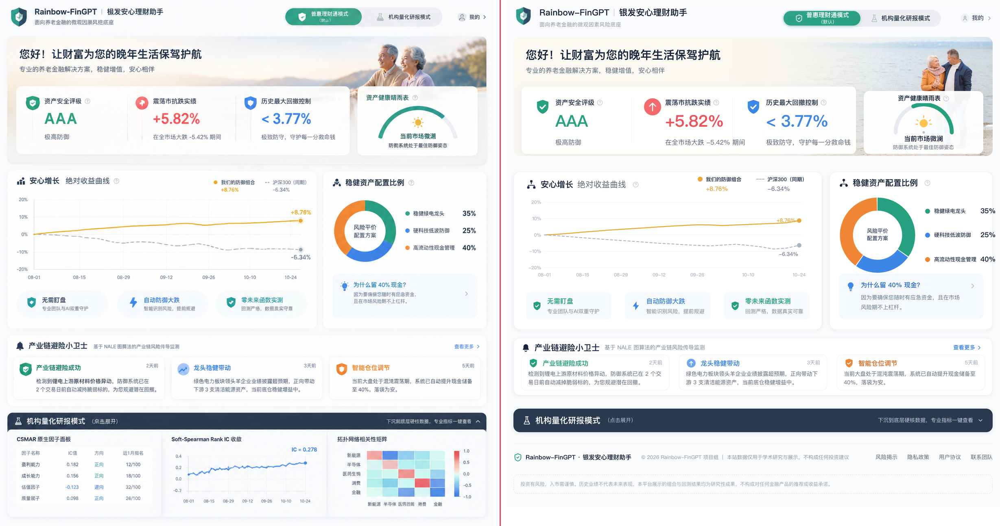

# Rainbow-FinGPT Web

React 18 + TypeScript + Vite + Tailwind CSS 3 + Lucide React，按设计稿 1:1 复现。

```bash
npm install     # 或 pnpm install
npm run dev     # http://localhost:5173
npm run build   # tsc -b && vite build（类型检查 + 生产构建）
```

本机已装好 Node 20 与依赖，`npm run build` 通过（tsc 无报错）。

## 后端对接

页面已接入 Rainbow-FinGPT 后端（`Rainbow-FinGPT-可落地部署包/`），不再只吃演示数据：

| 文件 | 作用 |
| --- | --- |
| `src/services/api.ts` | API 客户端：超时、错误体解析、基地址自动切换、4 个接口的 Promise 封装 |
| `src/types/api.ts` | **自动生成**的接口类型（39 个 schema + 每个 operation 的 Query / Request / Response） |
| `scripts/gen-api-types.py` | 由 `openapi.json` 生成 `src/types/api.ts` 的脚本 |
| `src/hooks/useHomepage.ts` | 拉取 `GET /api/v1/homepage`；**接口不可用时自动回退到同构快照**，纯静态托管也能完整渲染 |
| `src/data/mock.ts` | 兜底快照（真实数据快照，不是设计稿假数）；资源改用 `import.meta.env.BASE_URL` 拼接 |
| `src/vite-env.d.ts` | 补 `vite/client` 引用与自定义 `VITE_*` 声明（缺了它 strict 模式下 `import.meta.env` 会报错） |

页面只发一个请求就能渲染 Hero / 收益曲线 / 资产配置 / 事件流 / 策略表现五个区块，
聚合逻辑全部在后端 `src/homepage_api.py`，前端不做二次计算。

### 部署到后端

构建产物的资源前缀是 `/home/`（见 `vite.config.ts`），由 Flask 托管在 `/home`：

```bash
npm run build
cp -r dist/* ../Rainbow-FinGPT-可落地部署包/docs/home/
# 然后访问 http://127.0.0.1:5000/home
```

环境变量（复制 `.env.example` 为 `.env.local`）：
`VITE_API_BASE_URL` 覆盖后端地址（默认开发 `http://127.0.0.1:5000`、生产同源），
`VITE_LEGACY_HOME_URL` 覆盖旧看板跳转地址。

### 调用接口

```ts
import { fetchDataset, processData, fetchHomepage } from '@/services/api'

const page = await fetchDataset({ type: ['stock'], risk_level: ['low', 'medium'], sort: '-total_score' })
const result = await processData({ operation: 'allocate', top_n: 10, weighting: 'risk_inverse' })
const home = await fetchHomepage()
```

多值查询参数传数组即可（`type: ['stock', 'etf']`），客户端会按 OpenAPI 的
`style=form & explode=false` 规则拼成 `type=stock,etf`。

### 接口规格文件

项目根目录的 `openapi.json` 是后端接口规格（OpenAPI 3.0.3，4 条路径 / 38 个 schema），
供 Postman、Apifox、Swagger Editor 或代码生成工具直接导入。

后端跑起来后刷新它：

```bash
npm run api:spec      # = curl -fsS http://127.0.0.1:5000/api/v1/openapi.json -o openapi.json
```

端点输出的是缩进 2、中文不转义的 UTF-8 JSON，因此下载结果与仓库里这份**逐字节一致**，
刷新后没有真实改动就不会产生 diff。（后端是 Flask，端口 5000 / 双进程 5001；
不是 FastAPI 的 8000，路径也不是 `/openapi.json`。）

### 交互约定
### 交互约定

- 顶部「机构量化研报模式」按钮 → 跳转旧版看板（开发默认 `http://127.0.0.1:5000/`，生产默认 `/`）；
- 底部 06 研报面板是**独立折叠区**，不受上面这个按钮影响；
- 06 区块内容已从「因子面板 / IC 收敛 / 板块相关性矩阵」改为**策略表现**：
  策略对比表 / 策略净值走势 / 策略相关性矩阵（数据来自 2.4 年双版本回测）。

## 本轮修复（对照你给的两张截图）

### 1. 卡片副标题字号偏大 → 引入「随断点递减」的排版阶梯

设计稿画布是 1214px。原实现只在 `desk(≥1214)` 精确，一旦窗口变窄，卡片变窄而字号不变，于是就“显大、换行、被截断”（你截图里的 `安心增 长`、`零未来函数…`、`专业团队与AI…`）。

现在在 `src/styles/index.css` 里集中定义阶梯：**≥1214 严格等于设计稿字号，1024–1213 降一档，<1024 再降一档**。

| 语义类 | <1024 | 1024–1213 | ≥1214（设计稿） |
|---|---|---|---|
| `.t-card-title` 卡片主标题 | 17 | 19 | 20 |
| `.t-card-sub` 卡片副标题 | 17 | 19 | 20 |
| `.t-section-title` 区块标题 | 18 | 19 | 20 |
| `.t-section-sub` 区块副标题 | 12.5 | 13 | 13.5 |
| `.t-item-title` 小卡标题 | 14 | 15 | 16 |
| `.t-item-desc` 小卡副标 | 12 | 12.5 | 13 |
| `.t-body` 正文 | 12.5 | 13 | 13.5 |
| `.t-label` 图例/标签 | 12 | 12 | 12.5 |
| `.t-metric` Hero 大数值 | 32 | 36 | 40 |
| Hero H1 | 23 | 26 | 28 |

浏览器实测：1214 下 `h1=28px / t-card-title=20px / t-item-title=16px / t-body=13.5px`（= 设计稿），1000 下自动降到 `23 / 17 / 14 / 12.5`。

同时把卡片标题行改成 `flex-wrap`，窄屏时图例自动掉到第二行，不再挤压标题。

### 2. Hero 背景图 → 换素材 + 重做图层

原来的 `hero-bg.jpg` 是从设计稿截图里裁的，**把原图的指标卡和晴雨表一起裁了进去**——你看到的“下方功能区漏出来”就是这层重影；加上照片层 `inset-y-0` 会随 Hero 变高而拉伸，窄屏就把人裁成“只露个头”。

三处改动：

1. **换素材**：`public/hero-bg-v2.jpg`（960×502，CC0，可商用）。两位老人**全身完整**站在右侧、左侧留白给标题；不含任何 UI 元素，不会再有重影。来源与授权见 `public/hero-bg-v2.LICENSE.txt`。
2. **照片层锁高、贴右下**（`≥1214`）：`.hero-photo-desk { right:0; bottom:0; width:560px; height:293px }` —— 高度固定成设计稿的 293，不再随 Hero 变高而缩放。
3. **渐变改用 mask 羽化**：`.hero-photo-* > img` 用
   `mask-image: linear-gradient(90deg, transparent 0%, rgba(0,0,0,.5) 24%, #000 58%)`
   让照片自己溶解进暖白底。原先用「白色渐变盖住」的做法，白色和底色的色值会随宽度错位，出现可见接缝。

`<1214` 时照片改为「右上等比大图 + 正文下移」（`.hero-photo-band` 用 `aspect-ratio: 960/502`，正文 `padding-top: calc(min(100%,560px)/1.912 + 16px)` 自动让位），保证窄屏也能看到两位老人**完整**全身。

## 视觉验收



上：设计稿原图；下：真实构建产物在 1214 宽下的渲染。另有 [Header+Hero 放大对照](docs/对照_Header_Hero.png) 与多宽度截图 `docs/live/`（1214 / 1000 / 768 / 430）。

浏览器实测（`getBoundingClientRect` vs 设计稿）：

| 元素 | 设计稿 | 渲染 |
|---|---|---|
| Hero 容器 | x18 y91 1178×293 | x18 y91 1178×293 ✅ |
| 核心指标板 | x38 y213 822×166 | x38 y213 822×166 ✅ |
| 04 侧栏卡 | x795 401×386 | x795 401×389 ✅ |
| H1 / 卡片标题 / 小卡标题 / 正文 | 28 / 20 / 16 / 13.5 | 28 / 20 / 16 / 13.5 ✅ |

## 组件清单

```
src/
├─ types/index.ts        ViewMode / Tone / HeroData / EquityCurveData / AllocationSegment /
│                        CashNoteData / RiskEvent / ExpertData
├─ data/mock.ts          与设计稿一致的 Dummy Data（含 hero 背景图路径）
├─ lib/{cn,tone}.ts      类名合并 · 语义色映射
├─ components/
│  ├─ layout/            PageShell(Container·SectionStack) · SectionCard
│  ├─ ui/                SectionHeader · HelpTip
│  ├─ icons/             Shield Rise Bolt ArrowUpCircle Tree Org Bell Bulb
│  ├─ header/            BrandLockup · ModeSwitch · UserEntry
│  ├─ hero/              MetricCard · HealthGaugeCard · HealthGauge
│  └─ charts/            EquityCurveChart · DonutChart · IcConvergenceChart · CorrelationHeatmap
└─ sections/             Header · HeroSection · MainGrid · EquityCurvePanel · AllocationPanel
                         · RiskRadarSection · ExpertModeSection · Footer
```

图表全部手写 SVG（不引 ECharts），网格、轴位、末端标注与设计稿一致，包体零图表依赖。

## 交互态

| 组件 | hover | active | disabled |
|---|---|---|---|
| ModeSwitch | 未选中档浅底 | 切换胶囊 | `ModeOption.disabled` |
| 图例（03/04） | 预高亮对应曲线/环段 | 点击锁定 | ✅ |
| 价值点胶囊（03） | 上浮 + 白底 + 描边 | 压回压暗 | — |
| 现金面板（04） | 底色加深 | 透明度 70% | ✅ |
| 事件卡（05） | 上浮 + 语义色描边/浅底 | 压回 + 灰底 | `RiskEvent.disabled` |
| 研报深色条（06） | 底色提亮 | 压暗 | ✅ |
| 因子表行 / 热力图格（06） | 行底色 / 描边 + 读数条 | — | — |
| 收益曲线（03） | 竖向指示线 + 双数值气泡 | — | — |

统一约定：可交互元素都带 `focus-visible` 焦点环；禁用态用 `enabled:hover:` 前缀，避免禁用元素仍响应 hover。

## 文本与数字

- 单行溢出 `truncate`（标题、图例、表格名称），多行溢出 `line-clamp-2`（事件卡正文）
- `.num` = `tabular-nums`（大号指标数值，保持设计稿字形）
- `.num-mono` = 等宽字体栈 + `tabular-nums`（因子表 IC 值/排名、色标刻度、IC = 0.278）

## 栅格与断点

`desk: 1214px` 是自定义断点（= 设计稿画布宽）。容器 `max-w-page(1214) + px-[18px]`，宽屏下内容自然落成 1178 并居中。

| 断点 | 两栏区 | Hero | 研报三列 |
|---|---|---|---|
| `desk` ≥1214 | 759 / 401 | 照片贴右下固定 293，指标板 822 + 晴雨表 294 | 380 / 406 / 1fr |
| `lg` 1024–1213 | 1.9fr : 1fr | 照片右上等比，指标板三等分 | 三等分 |
| `md` 768–1023 | 单列 | 同上，指标板三等分 | 单列堆叠 |
| `<md` | 单列 | 照片通栏 + 正文下移，指标卡纵向堆叠 | 单列堆叠 |

## 数据接入

```tsx
<HeroSection data={heroFromApi} />
<EquityCurvePanel data={curveFromApi} />
<AllocationPanel segments={allocFromApi} cashNote={cashFromApi} />
<RiskRadarSection events={eventsFromApi} />
<ExpertModeSection open={open} onToggle={toggle} data={expertFromApi} />
```

模式切换由 `App.tsx` 持有（`retail` / `expert`），切换时同步 Hero 的模式徽标并自动展开研报面板。

## 素材说明

| 文件 | 状态 |
|---|---|
| `public/hero-bg-v2.jpg` | ✅ 现用。StockSnap CC0，960×502，见 `hero-bg-v2.LICENSE.txt` |
| `public/hero-bg.jpg` | ⚠️ 已弃用（从设计稿截图裁剪，带原图卡片重影），仅留作对照 |
| `public/logo.png` | ⚠️ 从设计稿裁出的位图，正式上线请换矢量 Logo |

> 早期为了在本机没有 Node 时做视觉验收，曾建过一份 `preview/*.html` 静态镜像；现在真实构建可跑，该镜像已删除，避免与源码漂移。对照图统一放在 `docs/`。
