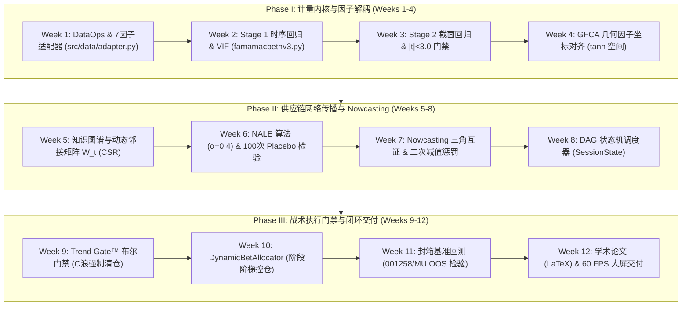

# Implementation Plan: StockDashboard v3.0 & Serenity Chokepoint 12-Week Joint Research & Implementation

## 1. Technical Context & Overview
- **Goal**: Implement the complete 12-week joint research & engineering roadmap across Phase I (Econometric Kernel & Factor Decoupling), Phase II (Supply Chain Graph Propagation & Nowcasting), and Phase III (Tactical Execution Gatekeepers & Bet Sizing).
- **Core Methodology**:
  1. *Two-Stage Fama-MacBeth OLS Kernel*: Rolling-window Stage 1 time-series OLS + Stage 2 cross-sectional OLS + Newey-West HAC covariance + Harvey et al. (2016) $|t| < 3.0$ factor prune gate.
  2. *GFCA (Geometric Factor Coordinate Alignment)*: Hyperbolic tangent ($\tanh$) filter mapping raw factor loadings into $[-1, 1]^K$.
  3. *NALE (Network-Augmented LLM Embeddings)*: Yılkı (2026) upstream-to-downstream transmission over quarterly-sliced dynamic sparse adjacency matrix $W_t$ ($\alpha = 0.4$) with 100-run Monte Carlo Placebo verification.
  4. *Nowcasting & Impairment Penalty*: Bypassing 1-3 month reporting lag via spot price monitoring and quadratic penalty $\text{Drift}_{\text{GFCA}} = -0.5 \times \Delta P^2$.
  5. *Trend Gate™ & Differential Position Sizing*: C-wave detection ($G_i \in \{0, 1\}$) triggering Emergency Liquidation + Catalyst Alpha / Super Beta / Event-Driven staged allocation (Sampling 20% $\to$ Batching 50% $\to$ Mass Production 100%).
  6. *Local Sealed-Box Delivery*: IEEE/Elsevier LaTeX Thesis (`reports/thesis/`), 60 FPS Dashboard data (`docs/data/`), CI/CD test suite (`tests/backtest_benchmark.py`). **(Note: strictly local, do not push to mentor's upstream repo)**.

---

## 2. Milestone Architecture & Deliverables

---

## 3. Data Model & File Layout

| File / Component | Type | Responsibility |
| :--- | :--- | :--- |
| `src/data/adapter.py` | Python Module | 统一多市场数据适配层（AKShare + Kenneth French + 东财妙想 $\to$ 标准 7 因子） |
| `src/analysis/famamacbethv3.py` | Python Module | 两阶段 Fama-MacBeth OLS 回归内核、VIF 诊断、Harvey $|t| < 3.0$ 修剪门禁 |
| `src/analysis/scoringv3.py` | Python Module | `align_gfca_coordinates` (tanh 映射) + `calculate_nale_score` (NALE 传播) |
| `src/graph/supply_chain_graph.py` | Python Module | 供应链有向知识图谱、季度切片动态稀疏矩阵 $W_t$、100 次边洗牌 Placebo 检验 |
| `src/nowcasting/triangle_validator.py` | Python Module | 韩国海关/DXI现货价高频数据通道 + 二次非对称减值惩罚函数 |
| `src/execution/trend_gate.py` | Python Module | Trend Gate™ MA20+MACD+波浪 C 浪侦测器 ($G_i \in \{0, 1\}$) |
| `src/execution/portfolio_allocator.py` | Python Module | `DynamicBetAllocator`（Catalyst / Super Beta / Event-Driven 证据阶梯配置） |
| `tests/backtest_benchmark.py` | Test Suite | 封箱回测仿真测试套件，输出 001258 / MU 净值曲线与回撤 |
| `reports/thesis/main.tex` | LaTeX Academic | 12周学术量化研究论文定稿源文件 |
