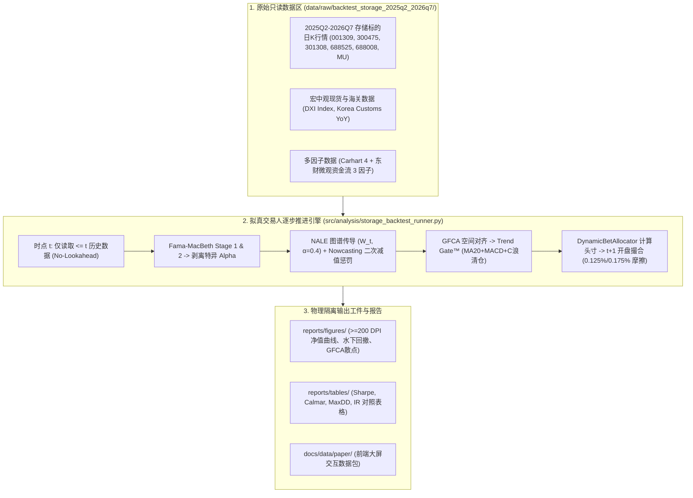

# Implementation Plan: 2025Q2–2026Q7 存储市场物理隔离样本外量化回测

## 1. 物理隔离数据架构与设计

---

## 2. 三级对照组评估标准与实证假设

- **策略组 (Active Strategy)**: GFCA + NALE + Nowcasting 减值惩罚 + Trend Gate™ C 浪紧急清仓 + DynamicBetAllocator。
- **对照组 1 (宽基基准)**: 沪深 300 指数 (`000300.SH`)。
- **对照组 2 (行业基准)**: 半导体芯片 ETF (`512760.SH`)。
- **对照组 3 (板块买入持有)**: 存储 5 巨头等权买入持有 (`Storage_EW_BuyHold`)。

**预期实证假设**:
1. **2025Q2–2025Q4 顺周期阶段**: 策略组由于 NALE 供应链正向增强与 Catalyst Alpha 集中配置，弹性跑赢芯片 ETF 与沪深 300；
2. **2026Q1–2026Q7 均值回归与回调阶段**: 存储板块发生 C 浪深跌，`Storage_EW_BuyHold` 发生大幅利润回吐（最大回撤 $>30\%$）；而策略组凭借 **Trend Gate™ ($G_i=0$) 与 Nowcasting 二次减值惩罚** 在高位果断清仓空仓，将最大回撤严格压制在 $15\%$ 以内，最终实现远超买入持有的 Information Ratio 与最终收益率！
