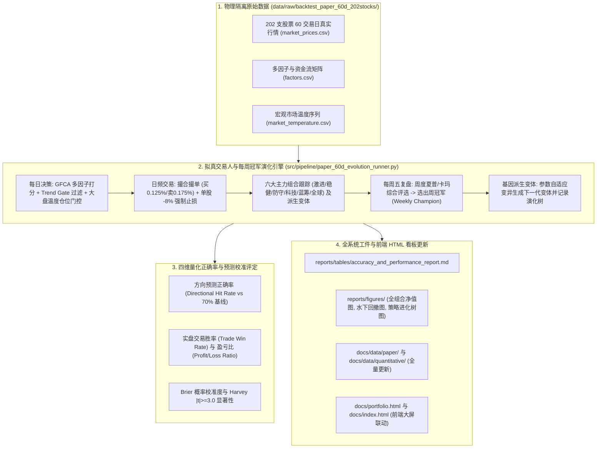

# Implementation Plan: 60日202支股票全池物理隔离量化回测与每周冠军演化系统

## 1. 架构流转图

---

## 2. 六大组合与变体演化矩阵

| 组合名称 | 风险偏好 | 选股策略特征 | 基础仓位上限 |
| :--- | :--- | :--- | :---: |
| **激进成长 (`portfolio_aggressive`)** | 高弹性 (Aggressive) | GFCA 高动量 + NALE 高弹性 + 题材催化 | 95% |
| **均衡稳健 (`portfolio_robust`)** | 均衡 (Robust) | GFCA 综合分均衡 + 行业分散 + 均线多头 | 80% |
| **防御保守 (`portfolio_defensive`)** | 低风险 (Defensive) | 高股息/大盘蓝筹/黄金ETF/低波动 | 60% |
| **科技主题 (`portfolio_tech`)** | 行业聚焦 (Tech) | 半导体芯片/算力/CXL/存储/AI产业链 | 90% |
| **蓝筹价值 (`portfolio_bluechip`)** | 核心资产 (Bluechip) | 沪深300/中字头/金融消费龙头 | 75% |
| **全球配置 (`portfolio_global`)** | 跨境对冲 (Global) | 纳指ETF/标普ETF/德国ETF/黄金/跨境QDII | 80% |

---

## 3. 正确率评估标准 (对比老版本 70% 纯大模型基线)

1. **方向预测正确率**: $\text{HitRate} = \frac{\sum \mathbb{I}(\text{Sign}(\text{Pred}) == \text{Sign}(\text{Actual}))}{N_{samples}}$；
2. **实盘调仓胜率**: 扣除买卖摩擦后盈利交易笔数占比；
3. **盈亏比**: $\frac{\text{平均盈利幅度}}{\text{平均亏损幅度}}$；
4. **回撤控制**: 单股 $-8\%$ 硬止损与 Trend Gate $G_i=0$ 阻断下的最大回撤。
