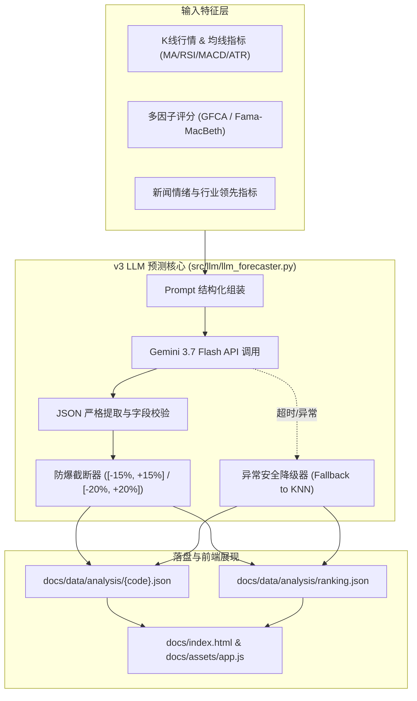

# 计划 014: v3 版本直接 LLM 预测引擎架构与实施计划 (Implementation Plan)

## 1. 架构流图 (Architecture Diagram)

---

## 2. 详细技术实现方案

1. **核心预测类 `src/llm/llm_forecaster.py`**：
   - 继承项目统一的 `LLMClient`；
   - 编写专门的量化直接推断 Prompt，要求必须只输出合规 JSON；
   - 编写数值安全清洗器 `_clamp_values`；
2. **流水线适配 `src/build_ranking.py`**：
   - 在 `analyze_single` 或 `build_stock_detail` 中调用 `LLMForecaster.forecast_single(item, df, scores, leading)`；
3. **前端呈现 `docs/index.html` & `docs/assets/app.js`**：
   - 更新 HTML 指标网格中的文案标签；
   - 优化 JS 渲染器 `renderAnalysisDetail`。
